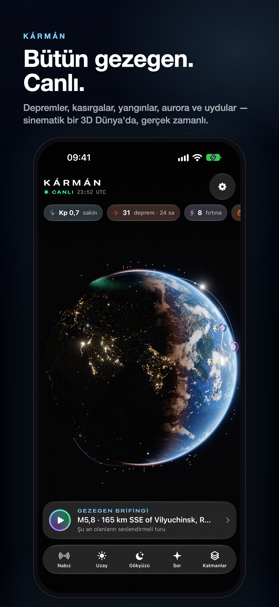

# Kármán — Live Earth

> The whole planet, live. A premium iOS app that renders a cinematic real-time Earth — earthquakes, storms, wildfires, aurora, the Sun, 11,000 satellites — and narrates it to you every day with AI. One purchase, no subscription.

**Kármán**, gezegende şu an olan her şeyi sinematik bir 3D Dünya üzerinde canlı gösteren, yapay zekâ ile her gün seslendirmeli bir "belgesel turu" hazırlayan premium (tek seferlik ücretli) bir iOS uygulamasıdır. Adını, uzayın başladığı kabul edilen 100 km'lik **Kármán çizgisinden** alır — uygulamanın bakış açısı tam olarak orası.



---

## İçindekiler

- [Özellikler](#özellikler)
- [Mimari](#mimari)
- [Depo yapısı](#depo-yapısı)
- [iOS uygulamasını derleme](#ios-uygulamasını-derleme)
- [Sunucu (backend) kurulumu](#sunucu-backend-kurulumu)
- [Yapay zekâ (Claude) ayarları ve maliyet](#yapay-zekâ-claude-ayarları-ve-maliyet)
- [Push bildirimleri (APNs)](#push-bildirimleri-apns)
- [App Store'a gönderme kontrol listesi](#app-storea-gönderme-kontrol-listesi)
- [Testler](#testler)
- [Veri kaynakları ve atıflar](#veri-kaynakları-ve-atıflar)

---

## Özellikler

| | |
|---|---|
| **Canlı 3D Dünya (Metal)** | Gece şehir ışıkları (NASA Black Marble), 8K gündüz dokusu (Blue Marble), GEBCO rölyef gölgelemesi, sürüklenen bulutlar ve bulut gölgeleri, okyanus güneş parlaması, analitik atmosfer saçılması, terminatörde alacakaranlık bandı, gerçek yıldız haritası (Yale Bright Star Catalogue, GMST ile doğru konumda), güneş + lens flare, iki katmanlı bloom ve ACES ton eşleme. |
| **Açılış sinematiği** | Gece tarafından başlayan, Güneş'in Dünya'nın kenarından doğduğu "yörüngeden gün doğumu" sahnesi; harf harf beliren başlık. |
| **Canlı olaylar** | USGS depremleri (nabız gibi atan dalga halkaları), NASA EONET kasırga/tayfun rotaları (dönen ikonlar), orman yangınları (közler), volkanlar, buzdağları, roket fırlatmaları, NOAA OVATION modeliyle canlı aurora perdeleri. |
| **Uydular** | ISS, Tiangong ve parlak uydular + isteğe bağlı **11.000+ Starlink sürüsü**; tamamı cihazda SGP4 ile (Python referans uygulamasıyla birebir doğrulanmış) gerçek zamanlı hesaplanır, Dünya'nın gölgesindekiler sönükleşir. |
| **Gezegen Brifingi** | Yapay zekânın canlı verilerden yazdığı 5–7 sahnelik senaryo; kamera her olaya eğik sinematik açıyla uçar, ses sentezi anlatır, altyazılar kelime kelime yanar, arka planda gerçek zamanlı sentezlenen ambiyans müziği çalar. API'ye ulaşılamazsa cihaz üzerinde yerel brifing üretilir. |
| **Deprem detayı** | Hiposantırdan yayılan animasyonlu sismik dalgalarla kabuk/manto kesiti, TNT eşdeğeri enerji, artçı grafiği ve **"Hisset"**: büyüklüğe göre şekillenen dokunsal (CoreHaptics) sismogram. |
| **Uzay Havası** | GOES-19 SUVI'den birkaç dakika önceki canlı Güneş görüntüsü (3 dalga boyu), Kp göstergesi, konumuna göre aurora görme ihtimali, gerçek kıtalar üzerinde kutup aurora haritası, güneş rüzgârı/Bz, X-ışını grafiği ve patlamalar, 3 günlük Kp tahmini, NOAA uyarıları. |
| **Bu Gece Gökyüzü** | Ay evresi (NASA LRO dokusuyla render), ay doğuşu/batışı, 24 saatlik ışık zaman çizelgesi (altın/mavi saat), görünür ISS/Tiangong geçişleri + gök kubbesi çizimi ve hatırlatıcı, fırlatma geri sayımları, asteroit geçişleri. |
| **Dünkü gerçek Dünya** | NASA GIBS VIIRS günlük mozaiği ile küre dünün gerçek bulut/tayfun/duman görüntüsüyle kaplanır. |
| **Kármán'a Sor** | Canlı veriyle beslenen, akış (streaming) yanıtlı gezegen bilimci sohbet asistanı. |
| **Widget'lar** | Şu An Dünya (gerçek gece/gündüz render), Aurora & Kp, Uzay İstasyonu (ISS + Tiangong); kilit ekranı widget'ları. |
| **Canlı Etkinlik** | Bir fırlatma için hatırlatıcı kurunca kilit ekranında ve Dynamic Island'da canlı geri sayım. |
| **Bu anı paylaş** | Kürenin o anki render'ı + tarih, günün sayıları ve konumla 4:5 markalı kartpostal (sosyal medya için). |
| **Siri & Kestirmeler** | "Gezegen brifingini oynat", "Uzay havasını göster", "Bu gece gökyüzü" — Eylem Düğmesi'ne de atanabilir. |
| **Uyarılar** | Yakındaki depremler, M7+ büyük depremler, konumundan görülebilir aurora, G3+ jeomanyetik fırtınalar, fırlatmalar (sunucudan APNs) ve ISS geçişleri (cihazda yerel). |
| **Gizlilik** | Hesap yok, reklam yok, takip yok. Hassas konum cihazdan çıkmaz (sunucuya ~50 km yuvarlanmış gider). |
| **Dil** | İngilizce + tam Türkçe yerelleştirme. |

## Mimari

```
iOS (SwiftUI + Metal, iOS 26+)          Kármán API (Go, tek binary)              Kaynaklar
┌──────────────────────────┐   HTTPS    ┌─────────────────────────────┐   ┌────────────────────┐
│ Metal globe renderer     │  (pinned)  │ feeds: pollers + cache      │◄──│ USGS, NOAA SWPC,   │
│ SGP4 / Astro (on device) │◄──────────►│ /v1/snapshot (36 KB gzip)   │   │ NASA EONET/GIBS/   │
│ Briefing director + TTS  │            │ /v1/satellites, /v1/sun     │   │ NeoWs, CelesTrak,  │
│ Widgets (App Group)      │            │ /v1/briefing  (Claude)      │──►│ Launch Library 2   │
│ StoreKit AppTransaction  │            │ /v1/ask (SSE, Claude)       │   │ Anthropic Claude   │
└──────────────────────────┘            │ AppTransaction JWS verify   │   │ APNs               │
                                        │ APNs alert engine, SQLite   │   └────────────────────┘
                                        └─────────────────────────────┘
```

- **Neden backend?** Kaynak formatları değiştiğinde (ör. NOAA bu yıl JSON şemasını değiştirdi) uygulamayı güncellemeden sunucuda düzeltilir; CelesTrak/Launch Library kota kurallarına uyulur; Claude API anahtarı cihazda değil sunucuda kalır; push uyarıları için gereklidir.
- **Dayanıklılık:** API'ye ulaşılamazsa uygulama USGS ve NOAA'dan doğrudan veri çeker; brifing cihazda üretilir; her şey önbellekten anında açılır.
- **Güvenlik:** Sunucu kendi imzalı TLS sertifikası kullanır, uygulama sertifikanın açık anahtarını (SPKI) sabitler — yanlış sertifikalı sunucuya tek bir istek bile gönderilmediği test edildi. Yapay zekâ uç noktaları Apple'ın imzaladığı **AppTransaction** (satın alma kanıtı) ile korunur ve kullanıcı başı günlük kotası vardır.

## Depo yapısı

```
Karman/                 iOS uygulaması
  App/                  giriş noktası, AppModel
  Render/               Metal renderer, kamera, shader'lar (Shaders/Globe.metal)
  Features/             Globe HUD, Briefing, SpaceWeather, Sky, Ask, Events, Settings
  Core/                 servisler (veri, konum, uydu motoru, bildirim, haptik, AI)
  Resources/            NASA dokuları, yıldız kataloğu, tr.lproj, ikon
KarmanWidgets/          WidgetKit eklentisi
Shared/                 uygulama + widget ortak kod (modeller, API istemcisi, SGP4, astronomi)
KarmanTests/            birim testleri
backend/                Go API (cmd/karman, internal/*), deploy/ (kurulum betiği, TLS)
marketing/              App Store görselleri (en/tr), önizleme videosu, meta veriler, ikon
tools/                  doku işleme, ikon render, çeviri ve ekran görüntüsü betikleri
project.yml             XcodeGen proje tanımı
```

## iOS uygulamasını derleme

Gereksinimler: Xcode 27, iOS 26+ hedef, [XcodeGen](https://github.com/yonaskolb/XcodeGen) (`brew install xcodegen`).

1. `project.yml` içinde `DEVELOPMENT_TEAM` alanına Apple Developer Team ID'ni yaz.
2. Gerekirse bundle ID'leri (`com.adilemre.karman`, `com.adilemre.karman.widgets`) ve App Group'u (`group.com.adilemre.karman`) kendi hesabına göre değiştir (`Karman/Karman.entitlements`, `KarmanWidgets/KarmanWidgets.entitlements`, `Shared/WidgetState.swift`).
3. Developer hesabında açılacak yetenekler: **App Groups**, **Push Notifications**, **Time Sensitive Notifications**.
4. Projeyi üret ve aç:
   ```bash
   xcodegen generate
   ```
   ```bash
   open Karman.xcodeproj
   ```
5. API adresi ve sertifika sabitlemesi `project.yml` → `KARMAN_API_BASE_URL` / `KARMAN_API_PIN` (şu an `https://92.5.38.182:8443` ve bu depodaki sertifikanın pin'i). Sunucuyu bir alan adına taşırsan (gerçek sertifikayla) `KARMAN_API_PIN`'i boş bırakman yeterli.

Simülatörde yerel backend ile test (yalnızca DEBUG):
```bash
SIMCTL_CHILD_KARMAN_API_BASE_URL=http://127.0.0.1:8787 SIMCTL_CHILD_KARMAN_FAKE_LOCATION="41.01,28.98,Istanbul" xcrun simctl launch booted com.adilemre.karman
```
Kendi cihazında DEBUG derlemesiyle yapay zekâ özelliklerini denemek için (Xcode'dan çalıştırılan uygulamaların App Store satın alma kanıtı olmaz): sunucuda `KARMAN_DEV_TOKEN=<gizli-bir-değer>` ayarla ve aynı değeri `project.yml` → `configs.Debug.KARMAN_DEV_TOKEN` alanına yaz. Release derlemeleri bu anahtarı asla içermez.

`KARMAN_SCREEN=hero|briefing|quake|storm|space|sky|ask|realearth|starlink|pulse|preview` ile uygulama ekran görüntüsü sahnelerine otomatik gider (`tools/compose_screenshots.py` bu çekimlerden App Store görsellerini üretir).

## Sunucu (backend) kurulumu

Tek Go binary'si; Docker gerekmez. Sunucudaki hiçbir mevcut servise (nginx dahil) dokunmaz: ayrı `karman` sistem kullanıcısı, her şey `/opt/karman` altında, kendi portunda (8443) kendi TLS sertifikasıyla çalışan sıkılaştırılmış bir `systemd` servisi.

```bash
backend/deploy/deploy.sh root@92.5.38.182 ~/.ssh/id_ed25519_sevgili 8443
```

Betik: sunucu mimarisini algılar → Linux binary'sini derler → yükler → `karman` kullanıcısını ve servisi kurar → uygulamaya gömülü pin'e karşılık gelen sertifikayı (`backend/deploy/certs/`, git'e girmez) kurar → sağlık kontrolü yapar. Host güvenlik duvarı (ufw) aktifse yalnızca 8443/tcp'yi açar. Bulut sağlayıcının güvenlik grubunda da 8443/tcp'nin açık olması gerekir.

Yapılandırma: `/opt/karman/karman.env` (değiştirdikten sonra `systemctl restart karman`):

| Değişken | Açıklama |
|---|---|
| `ANTHROPIC_API_KEY` | Claude anahtarı. Boşsa brifingler şablonla üretilir, "Sor" kapalı olur. |
| `KARMAN_AI_MODEL` | Varsayılan `claude-opus-5-5`. |
| `KARMAN_ASK_DAILY_LIMIT` | Kullanıcı başı günlük soru hakkı (varsayılan 25). |
| `NASA_API_KEY` | api.nasa.gov anahtarı (ücretsiz; `DEMO_KEY` ile de çalışır). |
| `APNS_KEY_PATH`, `APNS_KEY_ID`, `APNS_TEAM_ID` | Push için `.p8` anahtarı. |
| `KARMAN_APPLE_APP_ID` | App Store'daki sayısal uygulama kimliği (AppTransaction doğrulamasını sıkılaştırır). |
| `KARMAN_ALLOW_SANDBOX` | TestFlight/inceleme satın almalarını kabul et (varsayılan `true`). |

Uç noktalar: `/healthz`, `/privacy`, `/v1/snapshot`, `/v1/satellites/{stations|visual|starlink}`, `/v1/imagery/latest`, `/v1/sun/{304|171|195}`, `/v1/briefing?lang=tr`, `/v1/ask` (SSE), `/v1/auth/app-transaction`, `/v1/devices`.

Yerelde çalıştırma:
```bash
cd backend && go run ./cmd/karman
```

## Yapay zekâ (Claude) ayarları ve maliyet

- **Brifing:** dil başına 3 saatte bir **tek kez** üretilir ve tüm kullanıcılar paylaşır (structured outputs ile JSON şeması garantili; her sahne canlı veri öğesine bağlanır, uydurma olay olamaz). Maliyet kullanıcı sayısından bağımsızdır.
- **Kármán'a Sor:** `effort: low`, canlı veri özeti istem önbelleğinde (prompt caching) tutulur, kullanıcı başı günlük kota vardır.
- Claude'un güvenlik sınıflandırıcıları nadiren bir isteği reddederse, sunucu tarafı **otomatik yedek model (fallbacks: "default")** devreye girer.
- Model `KARMAN_AI_MODEL` ile değiştirilebilir; daha düşük maliyet istersen bu değişkenle başka bir Claude modeli seçebilirsin.

## Push bildirimleri (APNs)

1. Apple Developer → Keys → yeni anahtar (Apple Push Notifications service) → `.p8` dosyasını indir.
2. Dosyayı sunucuya kopyala: `/opt/karman/AuthKey_XXXX.p8` (`chown karman:karman`, `chmod 600`).
3. `karman.env` içinde `APNS_KEY_PATH`, `APNS_KEY_ID`, `APNS_TEAM_ID` alanlarını doldur ve servisi yeniden başlat.

ISS geçiş hatırlatmaları sunucu gerektirmez; cihazda hesaplanıp yerel bildirim olarak planlanır.

## App Store'a gönderme kontrol listesi

- [ ] App Store Connect'te uygulamayı oluştur: ad **Kármán: Live Earth**, bundle `com.adilemre.karman`.
- [ ] Fiyat: **9,99 USD** (ücretli; abonelik yok). Gerekçe `marketing/AppStore-Metadata.md` içinde.
- [ ] Meta veriler (EN + TR, karakter sınırları kontrol edildi): `marketing/AppStore-Metadata.md`.
- [ ] Ekran görüntüleri (6.9", 1320×2868): `marketing/appstore/en/` ve `marketing/appstore/tr/`.
- [ ] Uygulama önizlemeleri (886×1920, 28,6 sn): `marketing/app-preview/karman-preview-en-886x1920.mp4` ve `karman-preview-tr-886x1920.mp4`.
- [ ] Gizlilik politikası URL'si: `/privacy` sayfasını güvenilir sertifikalı bir adreste yayınla (ör. kendi alan adın veya GitHub Pages).
- [ ] App Privacy etiketi: "Data Not Linked to You → Coarse Location, Other User Content", takip yok (`Karman/Resources/PrivacyInfo.xcprivacy` ile uyumlu).
- [ ] Sunucuda `ANTHROPIC_API_KEY` ve APNs anahtarı ayarlı, `https://SUNUCU:8443/healthz` → `"ai": true, "push": true`.
- [ ] Ayarlar → "Kármán'ı paylaş" bağlantısındaki `id0000000000` değerini App Store kimliğinle değiştir (`Karman/Features/Settings/SettingsView.swift`).
- [ ] Xcode → Product → Archive → Distribute (App Store Connect).

## Testler

```bash
cd backend && go test ./...
```
```bash
xcodebuild test -project Karman.xcodeproj -scheme Karman -destination 'platform=iOS Simulator,name=iPhone 18 Pro Max'
```
- Go: Claude istek şekli (model, effort, structured output, fallback başlığı), sahne doğrulama, SSE akışı, şablon brifingler.
- iOS: SGP4'ün Python referans uygulamasıyla birebir eşleşmesi, güneş/ay konumları, gün batımı, aurora görünürlük modeli.

## Veri kaynakları ve atıflar

USGS Earthquake Hazards Program · NOAA Space Weather Prediction Center (Kp, OVATION, RTSW, GOES X-ray, SUVI) · NASA EONET · NASA GIBS/EOSDIS (VIIRS) · NASA Visible Earth (Blue Marble NG, Black Marble 2016) · GEBCO · NASA SVS CGI Moon Kit · Yale Bright Star Catalogue (NASA ADC) · CelesTrak · The Space Devs (Launch Library 2) · NASA JPL/CNEOS NeoWs · Anthropic Claude.

Görseller ve veriler kamu malıdır (NASA/NOAA/USGS) ya da kaynaklarının kullanım koşullarına uygundur; uygulama içinde Ayarlar → Veri kaynakları ekranında atıflar yer alır.
