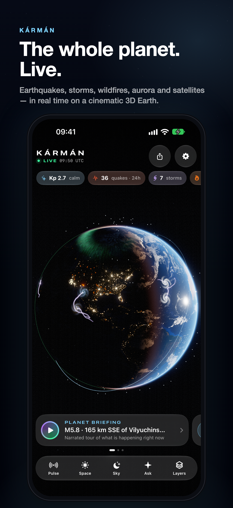

# Kármán — Live Earth

> The whole planet, live. A premium iOS app that renders a cinematic real-time Earth — earthquakes, storms, wildfires, aurora, the Sun, 11,000 satellites — and narrates it to you every day with AI. One purchase, no subscription.

**Kármán**, gezegende şu an olan her şeyi sinematik bir 3D Dünya üzerinde canlı gösteren, yapay zekâ ile her gün seslendirmeli bir "belgesel turu" hazırlayan premium (tek seferlik ücretli) bir iOS uygulamasıdır. Adını, uzayın başladığı kabul edilen 100 km'lik **Kármán çizgisinden** alır — uygulamanın bakış açısı tam olarak orası.



---

## İçindekiler

- [Özellikler](#özellikler)
- [Mimari](#mimari)
- [Depo yapısı](#depo-yapısı)
- [iOS uygulamasını derleme](#ios-uygulamasını-derleme)
- [Sunucu (backend) kurulumu](#sunucu-backend-kurulumu)
- [Tanıtım sitesi](#tanıtım-sitesi)
- [Gizlilik ve Destek sayfaları](#gizlilik-ve-destek-sayfaları-app-store-için)
- [Yapay zekâ (Claude) ayarları ve maliyet](#yapay-zekâ-claude-ayarları-ve-maliyet)
- [Push bildirimleri (APNs)](#push-bildirimleri-apns)
- [App Store'a gönderme kontrol listesi](#app-storea-gönderme-kontrol-listesi)
- [Testler](#testler)
- [Veri kaynakları ve atıflar](#veri-kaynakları-ve-atıflar)

---

## Özellikler

| | |
|---|---|
| **Canlı 3D Dünya (Metal)** | Gece şehir ışıkları (NASA Black Marble), 8K gündüz dokusu (Blue Marble), GEBCO rölyef gölgelemesi, okyanus güneş parlaması, analitik atmosfer saçılması, terminatörde alacakaranlık bandı, gerçek yıldız haritası (Yale Bright Star Catalogue, GMST ile doğru konumda), güneş + lens flare, iki katmanlı bloom ve ACES ton eşleme. |
| **Samanyolu** | Yıldızların arkasında, galaktik koordinatlarda gerçek yerinde duran ve gökyüzüyle birlikte dönen Samanyolu: galaksi merkezi, toz şeritleri ve Büyük Yarık, Kömür Çuvalı, yıldız bulutları, salma bulutsuları, Macellan Bulutları ve Andromeda. Üçüncü taraf görsel kullanılmadan prosedürel olarak boyandı (`tools/build_milkyway.py`). |
| **3B bulutlar** | Bulutlar zeminden ayrı bir kabukta: eğimlerinden kabartma ışığı alır, Güneş batarken altın sonra pembe renge döner ve zemin karardıktan sonra da bir süre parlar (yörüngeden gün batımı); gölgeleri Güneş ışınının doğrultusunda zemine düşer, kenara doğru kalınlaşır. |
| **Dünya'nın İçi** | Gezegen portakal dilimi gibi kesilir: kabuk, yavaşça konveksiyon yapan manto, çalkalanan sıvı dış çekirdek ve beyaz-sıcak iç çekirdek gerçek (PREM) yarıçaplarında, animasyonlu ve parıltılı. Katman adları, derinlik ve sıcaklıklar çizgilerle kesite bağlı; "senin tam altındaki karşı nokta" dahil dönen bilgi kartları. |
| **Ay ve kozmik zoom** | Ay gerçek boyutu, uzaklığı ve evresiyle sahnede: yakın yüzü Dünya'ya dönük, dolunayda kenarına kadar eşit parlak (Lommel-Seeliger), gece tarafında Dünya ışığı, ay tutulmasında bakır-kırmızı. 200 Dünya yarıçapına kadar uzaklaşıp Ay'ın yörüngesini görebilirsin. |
| **Güneş Sistemi** | Sekiz gezegen gerçek yörüngelerinde (JPL elemanları; uzaklıklar sığması için sıkıştırılmış): yörünge izleri, Satürn'ün gerçek eğimdeki halkaları, kendi Kepler saatinde dönen asteroit kuşağı. ±10 yıl zaman makinesi (günden yıla hız), döndür/yakınlaştır; gezegene dokununca Güneş'e ve bize uzaklığı, ışığının kaç dakikada geldiği ve bu gece görünüp görünmediği. |
| **Açılış sinematiği** | Gece tarafından başlayan, Güneş'in Dünya'nın kenarından doğduğu "yörüngeden gün doğumu" sahnesi; harf harf beliren başlık. |
| **Canlı olaylar** | USGS depremleri (nabız gibi atan dalga halkaları), NASA EONET kasırga/tayfun rotaları (dönen ikonlar), orman yangınları (közler), volkanlar, buzdağları, roket fırlatmaları, NOAA OVATION modeliyle canlı aurora perdeleri. |
| **Uydular** | ISS, Tiangong ve parlak uydular + isteğe bağlı **11.000+ Starlink sürüsü**; tamamı cihazda SGP4 ile (Python referans uygulamasıyla birebir doğrulanmış) gerçek zamanlı hesaplanır, Dünya'nın gölgesindekiler sönükleşir. |
| **Gezegen Brifingi** | Yapay zekânın canlı verilerden yazdığı 5–7 sahnelik senaryo; kamera her olaya eğik sinematik açıyla uçar, ses sentezi anlatır, altyazılar kelime kelime yanar, arka planda gerçek zamanlı sentezlenen ambiyans müziği çalar. API'ye ulaşılamazsa cihaz üzerinde yerel brifing üretilir. |
| **Deprem detayı** | Hiposantırdan yayılan animasyonlu sismik dalgalarla kabuk/manto kesiti, TNT eşdeğeri enerji, artçı grafiği ve **"Hisset"**: büyüklüğe göre şekillenen dokunsal (CoreHaptics) sismogram. |
| **Uzay Havası** | GOES-19 SUVI'den birkaç dakika önceki canlı Güneş görüntüsü (3 dalga boyu), Kp göstergesi, konumuna göre aurora görme ihtimali, gerçek kıtalar üzerinde kutup aurora haritası, güneş rüzgârı/Bz, X-ışını grafiği ve patlamalar, 3 günlük Kp tahmini, NOAA uyarıları. |
| **Bu Gece Gökyüzü** | Saat saat **yıldız gözlem skoru** (MET Norway bulut tahmini + karanlık + Ay ışığı + nem), en iyi zaman aralığı ve tepedeki takımyıldızlar; **gezegenler** (JPL Kepler elemanları; Horizons'a göre <0,1°, parlaklık ±0,15 kadir) ne zaman, nerede, hangi takımyıldızda; **meteor yağmurları** (IMO) bulunduğun yerden beklenen saatlik sayı ve Ay uyarısıyla; Ay evresi, ay doğuşu/batışı, 24 saatlik ışık zaman çizelgesi, ISS/Tiangong geçişleri + gök kubbesi ve hatırlatıcı, fırlatmalar, asteroitler. |
| **Dünkü gerçek Dünya** | NASA GIBS VIIRS günlük mozaiği ile küre dünün gerçek bulut/tayfun/duman görüntüsüyle kaplanır. |
| **ISS ile uç** | Kamera Uluslararası Uzay İstasyonu'nu arkasından takip eder: 400 km yükseklikte, 28.000 km/sa; altında şehir ışıkları, aurora ve ince yeşil hava ışıması (airglow) kayar. Hız, irtifa, altındaki bölge ve bir sonraki yörünge gün doğumu/batımı geri sayımı. Siri: "Ride with the ISS in Kármán". |
| **Son 24 saati oynat** | Son günü 36 saniyede yeniden oynatır: gündüz küre üzerinde döner, yıldızlar yıldız zamanıyla döner, her deprem olduğu yerde ve anda dalgalanır; M5+ depremler dokunsal titreşim ve bildirimle. |
| **Yakın plan netliği** | Yaklaştıkça NASA GIBS'ten 500 m çözünürlüklü karolar akar: gündüz gölgeli kabartmalı Blue Marble, gece Black Marble şehir ışıkları. Karolar diskte önbelleğe alınır. |
| **Canlı Güneş** | GOES-19 SUVI'den son 6 saatin 24 karelik time-lapse'i, parıltılı (bloom) ve kenarı yumuşak kompozisyonla. |
| **Fırtına sarmalları** | Kasırga ve tayfunlar rüzgâr hızına göre boyutlanan, kuzeyde saat yönünün tersine, güneyde saat yönünde dönen prosedürel bulut sarmalları olarak çizilir. |
| **Denetim Merkezi kontrolü** | "Planet Briefing" kontrolü Denetim Merkezi'ne, Kilit Ekranı'na veya Eylem Düğmesi'ne eklenebilir. |
| **Canlı hava (NOAA GFS)** | GPU'da (Metal compute) gerçek 10 m rüzgârında akan binlerce parçacık, hıza göre renklenen kuyruklu şeritler; 2 m sıcaklık haritası (10 °C eş-sıcaklık çizgileri, donma çizgisi vurgulu) ve radar renklerinde yağış. Kareler arası zaman enterpolasyonu; **24 saatlik tahmin oynatıcı** (gündüz/gece de birlikte ilerler). Katman panelinde dünyanın şu anki en sıcak, en soğuk, en rüzgârlı ve en yağışlı noktaları (dokununca oraya uçar). |
| **Dokunduğun nokta** | Kürede herhangi bir yere dokun: yer adı, canlı sıcaklık/rüzgâr/yağış, 24 saatlik görünüm, yerel saat, Güneş yüksekliği, sana uzaklığı ve "Bunu sor". |
| **Sismik dalgalar** | Herhangi bir depremden P, S ve yüzey dalgalarının küre üzerinde yayılması (IASP91 seyahat süreleri, çekirdeğin gölge bölgesi, 90× hız). Dalgaların sana ve izlediğin yerlere varış süreleri, geçerken dokunsal titreşim, Atkinson & Wald (DYFI) bağıntısıyla tahmini sarsıntı şiddeti (MMI). |
| **Bir yılın depremleri** | Son 365 günün M4.5+ depremleri (USGS FDSN, ~8.000 olay) bir dakikada: her deprem gününde parlayıp köze dönüşür, sonunda levha sınırlarını çizer; Güneş mevsimlere göre salınır. Sayaçlar, M7+ çağrıları, yıl sonu özeti. |
| **Tektonik levhalar** | PB2002 modeli (uygulamaya gömülü): açılan sırtlar, yitim/çarpışma zonları ve transform faylar renkleriyle; levha adları; deprem detayında "tektonik ortam" açıklaması. |
| **Sky Lens (AR)** | Telefonu gökyüzüne tut: CoreMotion ile yıldızlar, takımyıldız çizgileri ve adları, gezegenler, Ay, Güneş, ISS/Tiangong ve aktif meteor yağmuru radyantları gerçek yerlerinde. İsteğe bağlı canlı kamera, kırmızı gece görüşü modu, yakınlaştırma, hedefe yönlendiren ok + titreşim. |
| **Kármán'a Sor** | Canlı veriyle beslenen, akış (streaming) yanıtlı gezegen bilimci. Yanıt akarken küre ilgili depreme/fırtınaya uçar (Claude tool use), mesajlarda tıklanabilir konum çipleri; her kartta "Bunu sor" bağlamı. İlk sorudan önce Anthropic'i adıyla anan açık izin ekranı (App Store Kural 5.1.2(i)); izin Ayarlar'dan geri alınabilir. |
| **İzlenen yerler** | Aile, ikinci ev gibi 5 yere kadar yer: yakınlarındaki depremler için uyarı (sunucuya ~50 km yuvarlanmış gider), kürede işaret, deprem/dalga ekranlarında uzaklık, varış süresi ve tahmini sarsıntı. |
| **Ambient küre** | Şarjdayken başucu için: büyük saat, yavaşça gezen ve geceleri kısılan küre (şafak çizgisi, gece şehir ışıkları, günün en güçlü depremi, fırtınalar, aurora), OLED yanığına karşı kayma, ekran açık kalır. |
| **Widget'lar** | Şu An Dünya (gerçek gece/gündüz render), Aurora & Kp, Uzay İstasyonu (ISS + Tiangong); kilit ekranı widget'ları. |
| **Canlı Etkinlik** | Bir fırlatma için hatırlatıcı kurunca kilit ekranında ve Dynamic Island'da canlı geri sayım; fırlatma ertelenirse hatırlatıcı ve geri sayım kendini günceller. |
| **Bu anı paylaş** | Kürenin o anki render'ı + tarih, günün sayıları ve konumla 4:5 markalı kartpostal (sosyal medya için). |
| **Siri & Kestirmeler** | "Gezegen brifingini oynat", "Uzay havasını göster", "Bu gece gökyüzü", "Sky Lens'i aç", "Bir yılın depremleri", "Rüzgâr tahminini oynat", "Ambient küre", "Dünya'nın içini göster"; Kestirmeler uygulamasında "Güneş Sistemini göster" — Eylem Düğmesi'ne de atanabilir. |
| **Uyarılar** | Yakındaki depremler, M7+ büyük depremler, konumundan görülebilir aurora, G3+ jeomanyetik fırtınalar, fırlatmalar (sunucudan APNs) ve ISS geçişleri (cihazda yerel). |
| **Gizlilik** | Hesap yok, reklam yok, takip yok. Hassas konum cihazdan çıkmaz (sunucuya ~50 km yuvarlanmış gider). |
| **Dil** | Yalnızca İngilizce (arayüz, Siri, widget'lar, brifing ve yanıtlar). Bölge biçimi farklı cihazlarda sayı ve tarih biçimi de İngilizceye sabitlenir. |

## Mimari

```
iOS (SwiftUI + Metal, iOS 26+)          Kármán API (Go, tek binary)              Kaynaklar
┌──────────────────────────┐   HTTPS    ┌─────────────────────────────┐   ┌────────────────────┐
│ Metal globe renderer     │  (pinned)  │ feeds: pollers + cache      │◄──│ USGS, NOAA SWPC,   │
│ + GPU wind particles     │◄──────────►│ /v1/snapshot (36 KB gzip)   │   │ NOAA GFS (ERDDAP), │
│ SGP4 / Astro / planets   │            │ /v1/weather (GFS frames)    │   │ USGS FDSN, NASA    │
│ Sky Lens (CoreMotion)    │            │ /v1/quakes/year, /v1/plates │   │ EONET/GIBS/NeoWs,  │
│ Briefing director + TTS  │            │ /v1/sky/clouds (MET Norway) │   │ MET Norway,        │
│ Widgets (App Group)      │            │ /v1/satellites, /v1/sun     │──►│ CelesTrak, LL2     │
│ StoreKit AppTransaction  │            │ /v1/briefing, /v1/ask (SSE, │   │ Anthropic Claude   │
└──────────────────────────┘            │   Claude tool use)          │   │ APNs               │
                                        │ APNs alert engine, SQLite   │   └────────────────────┘
                                        └─────────────────────────────┘
```

- **Neden backend?** Kaynak formatları değiştiğinde (ör. NOAA bu yıl JSON şemasını değiştirdi) uygulamayı güncellemeden sunucuda düzeltilir; CelesTrak/Launch Library kota kurallarına uyulur; Claude API anahtarı cihazda değil sunucuda kalır; push uyarıları için gereklidir.
- **Dayanıklılık:** API'ye ulaşılamazsa uygulama USGS ve NOAA'dan doğrudan veri çeker; brifing cihazda üretilir; her şey önbellekten anında açılır.
- **Güvenlik:** Sunucu kendi imzalı TLS sertifikası kullanır, uygulama sertifikanın açık anahtarını (SPKI) sabitler — yanlış sertifikalı sunucuya tek bir istek bile gönderilmediği test edildi. Yapay zekâ uç noktaları Apple'ın imzaladığı **AppTransaction** (satın alma kanıtı) ile korunur ve kullanıcı başı günlük kotası vardır.

## Depo yapısı

```
Karman/                 iOS uygulaması
  App/                  giriş noktası, AppModel
  Render/               Metal renderer, kamera, shader'lar (Shaders/Globe.metal)
  Features/             Globe HUD, Briefing, SpaceWeather, Sky, SkyLens, Weather, Seismic, Replay, Ambient, Ask, Events, Settings, Inside (Dünya'nın içi), Orrery (Güneş Sistemi), Cosmos
  Core/                 servisler (veri, hava, konum, uydu motoru, bildirim, haptik, AI), Astro (gezegenler, Güneş Sistemi, meteorlar), Seismic
  Resources/            NASA dokuları, yıldız kataloğu, Data/ (levha sınırları, takımyıldızlar), ikon
KarmanWidgets/          WidgetKit eklentisi
Shared/                 uygulama + widget ortak kod (modeller, API istemcisi, SGP4, astronomi)
KarmanTests/            birim testleri
backend/                Go API (cmd/karman, internal/*), deploy/ (kurulum betiği, TLS)
marketing/              App Store görselleri (en/tr), önizleme videosu, meta veriler, ikon
tools/                  doku işleme, ikon render, çeviri ve ekran görüntüsü betikleri
project.yml             XcodeGen proje tanımı
```

## iOS uygulamasını derleme

Gereksinimler: Xcode 27, iOS 26+ hedef, [XcodeGen](https://github.com/yonaskolb/XcodeGen) (`brew install xcodegen`).

1. `project.yml` içinde `DEVELOPMENT_TEAM` alanına Apple Developer Team ID'ni yaz.
2. Gerekirse bundle ID'leri (`com.adilemre.karman`, `com.adilemre.karman.widgets`) ve App Group'u (`group.com.adilemre.karman`) kendi hesabına göre değiştir (`Karman/Karman.entitlements`, `KarmanWidgets/KarmanWidgets.entitlements`, `Shared/WidgetState.swift`).
3. Developer hesabında açılacak yetenekler: **App Groups**, **Push Notifications**, **Time Sensitive Notifications**.
4. Projeyi üret ve aç:
   ```bash
   xcodegen generate
   ```
   ```bash
   open Karman.xcodeproj
   ```
5. API adresi ve sertifika sabitlemesi `project.yml` → `KARMAN_API_BASE_URL` / `KARMAN_API_PIN` (şu an `https://karman.adilemree.xyz:9443` ve bu depodaki sertifikanın pin'i). API kendinden imzalı sertifika kullanır; güven, uygulamadaki açık anahtar sabitlemesiyle (pin) sağlanır. iOS'un ATS kuralı IP adreslerine istisna tanımadığı için API bir alan adıyla çağrılır ve `Info.plist` içinde yalnızca bu alan adına özel bir ATS istisnası vardır (uygulama ve widget). Alan adını değiştirirsen bu istisnayı ve sertifikadaki adı da güncelle.

Simülatörde yerel backend ile test (yalnızca DEBUG):
```bash
SIMCTL_CHILD_KARMAN_API_BASE_URL=http://127.0.0.1:8787 SIMCTL_CHILD_KARMAN_FAKE_LOCATION="41.01,28.98,Istanbul" xcrun simctl launch booted com.adilemre.karman
```
Kendi cihazında DEBUG derlemesiyle yapay zekâ özelliklerini denemek için (Xcode'dan çalıştırılan uygulamaların App Store satın alma kanıtı olmaz): sunucuda `KARMAN_DEV_TOKEN=<gizli-bir-değer>` ayarla ve aynı değeri `project.yml` → `configs.Debug.KARMAN_DEV_TOKEN` alanına yaz. Release derlemeleri bu anahtarı asla içermez.

`KARMAN_SCREEN=hero|briefing|quake|quakeglobe|storm|space|sky|ask|askconsent|realearth|starlink|pulse|iss|liveactivity|preview` ile uygulama ekran görüntüsü sahnelerine otomatik gider (`tools/compose_screenshots.py` bu çekimlerden App Store görsellerini üretir).

## Sunucu (backend) kurulumu

Tek Go binary'si; Docker gerekmez. Sunucudaki hiçbir mevcut servise (nginx dahil) dokunmaz: ayrı `karman` sistem kullanıcısı, her şey `/opt/karman` altında, kendi portunda (9443) kendi TLS sertifikasıyla çalışan sıkılaştırılmış bir `systemd` servisi.

```bash
backend/deploy/deploy.sh root@92.5.38.182 ~/.ssh/id_ed25519_sevgili 9443
```

Betik: sunucu mimarisini algılar → Linux binary'sini derler → yükler → `karman` kullanıcısını ve servisi kurar → uygulamaya gömülü pin'e karşılık gelen sertifikayı (`backend/deploy/certs/`, git'e girmez) kurar → sağlık kontrolü yapar. Host güvenlik duvarı (ufw) aktifse yalnızca 8443/tcp'yi açar. Bulut sağlayıcının güvenlik grubunda da 8443/tcp'nin açık olması gerekir.

Bu sunucuda 8443 nginx tarafından kullanıldığı için API **9443** portunda çalışır. DNS: Cloudflare'de `karman` → `92.5.38.182` A kaydı, **proxy kapalı** (Cloudflare 9443'ü vekillemez). Sunucu Oracle Cloud'da: host güvenlik duvarı (iptables) yalnızca izin verilen portları kabul edip gerisini reddediyor. Kármán servisi kendi portunu `karman-api` etiketli tek bir kuralla başlarken açar, dururken kapatır; başka kural ya da dosya değişmez. Ayrıca **Oracle Cloud konsolunda** VCN güvenlik listesine (veya örneğe bağlı NSG'ye) bir giriş kuralı gerekir: kaynak `0.0.0.0/0`, TCP, hedef port `9443`.

Sertifikayı yenilemek veya adını değiştirmek (pin aynı kalsın diye mevcut anahtarla):
```bash
cd backend && go run ./cmd/karman gencert -host karman.adilemree.xyz,92.5.38.182 -key deploy/certs/tls.key -out deploy/certs
```
Ardından `deploy/certs/tls.crt` dosyasını sunucuda `/opt/karman/tls/tls.crt` yerine koyup `systemctl restart karman` çalıştır. Sertifika 820 gün geçerlidir (Apple'ın sınırı 825 gün).

Yapılandırma: `/opt/karman/karman.env` (değiştirdikten sonra `systemctl restart karman`):

| Değişken | Açıklama |
|---|---|
| `ANTHROPIC_API_KEY` | Claude anahtarı. Boşsa brifingler şablonla üretilir, "Sor" kapalı olur. |
| `KARMAN_AI_MODEL` | Varsayılan `claude-opus-5-5`. |
| `KARMAN_ASK_DAILY_LIMIT` | Kullanıcı başı günlük soru hakkı (varsayılan 25). |
| `NASA_API_KEY` | api.nasa.gov anahtarı (ücretsiz; `DEMO_KEY` ile de çalışır). |
| `APNS_KEY_PATH`, `APNS_KEY_ID`, `APNS_TEAM_ID` | Push için `.p8` anahtarı. |
| `KARMAN_APPLE_APP_ID` | App Store'daki sayısal uygulama kimliği (AppTransaction doğrulamasını sıkılaştırır). |
| `KARMAN_ALLOW_SANDBOX` | TestFlight/inceleme satın almalarını kabul et (varsayılan `true`). |
| `KARMAN_SUPPORT_EMAIL` | İsteğe bağlı; `/support` sayfasında iletişim adresi olarak gösterilir. MET Norway'in istediği iletişim bilgisi olarak da kullanılır. |
| `KARMAN_CONTACT` | İsteğe bağlı; `KARMAN_SUPPORT_EMAIL` yoksa MET Norway isteklerinin User-Agent'ındaki iletişim adresi. |
| `KARMAN_SITE_DIR` | Tanıtım sitesinin klasörü (betik `/opt/karman/site` olarak ayarlar); `/` adresinde sunulur. |

Uç noktalar: `/healthz`, `/privacy`, `/support`, `/v1/snapshot`, `/v1/satellites/{stations|visual|starlink}`, `/v1/imagery/latest`, `/v1/sun/{304|171|195}`, `/v1/briefing?lang=tr`, `/v1/ask` (SSE; `focus` olaylarıyla küre yönlendirme), `/v1/auth/app-transaction`, `/v1/devices` (izlenen yerler dahil), `/v1/weather` + `/v1/weather/{id}` (GFS kareleri, 360×181 RGBA8), `/v1/quakes/year`, `/v1/plates`, `/v1/sky/clouds?lat=&lon=`.

Yerelde çalıştırma:
```bash
cd backend && go run ./cmd/karman
```

## Tanıtım sitesi

`marketing/site/` tek başına yayınlanabilen statik bir sitedir: `index.html` (EN/TR, tarayıcı diline göre otomatik; `?lang=tr` ile zorlanabilir), uygulama önizleme videosu (2 MB), sıkıştırılmış ekran görüntüleri, `privacy.html` ve `support.html`. App Store Connect'teki **Marketing URL** alanına bu sitenin adresini yazabilirsin. Yerelde önizleme: `python3 -m http.server 8090 --directory marketing/site`.

## Gizlilik ve Destek sayfaları (App Store için)

App Store Connect, **Privacy Policy URL** ve **Support URL** için güvenilir sertifikalı herkese açık HTTPS adresleri ister. Sayfalar hazır (EN + TR): sunucuda `/privacy` ve `/support`, statik kopyaları `marketing/site/` içinde. İki kolay yol:

1. **Kendi alan adın (önerilen):** Kurulum betiği tanıtım sitesini de sunucuya yükler (`/opt/karman/site`, `KARMAN_SITE_DIR`). Sunucundaki nginx'e (bunu sen eklersin; betik nginx'e dokunmaz) mevcut HTTPS `server` bloğuna şunu ekle ve `nginx -s reload` yap:
   ```nginx
   location /karman/ {
       proxy_pass https://127.0.0.1:9443/;
       proxy_ssl_verify off;
       proxy_set_header X-Real-IP $remote_addr;
       proxy_set_header X-Forwarded-For $proxy_add_x_forwarded_for;
   }
   ```
   Adresler: tanıtım `https://<alan-adın>/karman/`, gizlilik `https://<alan-adın>/karman/privacy`, destek `https://<alan-adın>/karman/support`. (API, yalnızca yerel vekilden gelen `X-Real-IP` başlığına güvenir; hız sınırı ziyaretçi başına işler.)
2. **Statik barındırma (GitHub Pages vb.):** `marketing/site/` klasörünü yayınla. İletişim adresiyle yeniden üretmek için:
   ```bash
   cd backend && go run ./cmd/karman site -out ../marketing/site -support-email destek@ornek.com
   ```

## Yapay zekâ (Claude) ayarları ve maliyet

- **Brifing:** dil başına 3 saatte bir **tek kez** üretilir ve tüm kullanıcılar paylaşır (structured outputs ile JSON şeması garantili; her sahne canlı veri öğesine bağlanır, uydurma olay olamaz). Maliyet kullanıcı sayısından bağımsızdır.
- **Kármán'a Sor:** `effort: low`, canlı veri özeti istem önbelleğinde (prompt caching) tutulur, kullanıcı başı günlük kota vardır.
- Claude'un güvenlik sınıflandırıcıları nadiren bir isteği reddederse, sunucu tarafı **otomatik yedek model (fallbacks: "default")** devreye girer.
- Model `KARMAN_AI_MODEL` ile değiştirilebilir; daha düşük maliyet istersen bu değişkenle başka bir Claude modeli seçebilirsin.

## Push bildirimleri (APNs)

1. Apple Developer → Keys → yeni anahtar (Apple Push Notifications service) → `.p8` dosyasını indir.
2. Dosyayı sunucuya kopyala: `/opt/karman/AuthKey_XXXX.p8` (`chown karman:karman`, `chmod 600`).
3. `karman.env` içinde `APNS_KEY_PATH`, `APNS_KEY_ID`, `APNS_TEAM_ID` alanlarını doldur ve servisi yeniden başlat.

ISS geçiş hatırlatmaları sunucu gerektirmez; cihazda hesaplanıp yerel bildirim olarak planlanır.

## App Store'a gönderme kontrol listesi

- [ ] App Store Connect'te uygulamayı oluştur: ad **Kármán: Live Earth**, bundle `com.adilemre.karman`.
- [ ] Fiyat: **9,99 USD** (ücretli; abonelik yok). Gerekçe `marketing/AppStore-Metadata.md` içinde.
- [ ] Meta veriler (EN + TR, karakter sınırları kontrol edildi): `marketing/AppStore-Metadata.md`.
- [ ] Ekran görüntüleri (6.9", 1320×2868, 10 adet): `marketing/appstore/en/`.
- [ ] Uygulama önizlemesi (886×1920): `marketing/app-preview/karman-preview-en-886x1920.mp4`.
- [ ] Gizlilik politikası ve Destek URL'leri: `/privacy` ve `/support` sayfalarını güvenilir sertifikalı bir adreste yayınla (ör. kendi alan adın veya GitHub Pages). İstersen `KARMAN_SUPPORT_EMAIL` ile destek sayfasına iletişim adresi ekle.
- [ ] Yapay zekâ veri paylaşımı (Kural 5.1.2(i)): "Kármán'a Sor" ilk sorudan önce Anthropic'i adıyla anan tek seferlik bir izin ekranı gösterir; izin Ayarlar → Kármán'a Sor'dan geri alınabilir. İnceleme notu `marketing/AppStore-Metadata.md` içinde hazır.
- [ ] App Privacy etiketi: "Data Not Linked to You → Coarse Location, Other User Content", takip yok (`Karman/Resources/PrivacyInfo.xcprivacy` ile uyumlu). Kaba konum artık bulut tahmini ve izlenen yerler için de kullanılıyor (yine ~50 km, uygulama işlevi).
- [ ] Kamera izni metni (`NSCameraUsageDescription`) eklendi: Sky Lens'te kamera isteğe bağlı, görüntü kaydedilmez/gönderilmez.
- [ ] Sunucuda `ANTHROPIC_API_KEY` ve APNs anahtarı ayarlı, `https://karman.adilemree.xyz:9443/healthz` → `"ai": true, "push": true`.
- [ ] Ayarlar → "Kármán'ı paylaş" bağlantısındaki `id0000000000` değerini App Store kimliğinle değiştir (`Karman/Features/Settings/SettingsView.swift`) ve aynısını tanıtım sayfasındaki `APP_STORE_URL` sabitinde yap (`marketing/site/index.html`).
- [ ] Xcode → Product → Archive → Distribute (App Store Connect).

## Testler

```bash
cd backend && go test ./...
```
```bash
xcodebuild test -project Karman.xcodeproj -scheme Karman -destination 'platform=iOS Simulator,name=iPhone 18 Pro Max'
```
- Go: Claude istek şekli (model, effort, structured output, fallback başlığı), Ask araç döngüsü (show_on_globe), sahne doğrulama, SSE akışı, şablon brifingler, GFS ayrıştırma/kodlama, izlenen yer uyarıları.
- iOS: SGP4'ün Python referans uygulamasıyla birebir eşleşmesi, güneş/ay konumları, gün batımı, aurora görünürlük modeli, GFS ızgara çözme ve zaman enterpolasyonu, IASP91 seyahat süreleri ve MMI, levha sınırı sorguları, gezegen konumları (JPL Horizons'a karşı), Güneş Sistemi (Dünya'nın Güneş'e karşıt boylamı, Uranüs/Neptün, kapalı yörüngeler, ışık süreleri), meteor yağmuru tarihleri, yıldız gözlem skoru, Sky Lens geometrisi.

## Veri kaynakları ve atıflar

USGS Earthquake Hazards Program (+ FDSN Event Service) · NOAA Space Weather Prediction Center (Kp, OVATION, RTSW, GOES X-ray, SUVI) · NOAA GFS (PacIOOS ERDDAP üzerinden) · MET Norway Locationforecast (CC BY 4.0) · NASA EONET · NASA GIBS/EOSDIS (VIIRS) · NASA Visible Earth (Blue Marble NG, Black Marble 2016) · GEBCO · NASA SVS CGI Moon Kit · Yale Bright Star Catalogue (NASA ADC) · d3-celestial takımyıldız çizgileri ve yıldız adları (© Olaf Frohn, BSD-3-Clause; `tools/build_sky.py`) · PB2002 levha sınırları (P. Bird 2003, ODC-By 1.0; `tools/build_plates.py`) · JPL yaklaşık gezegen elemanları (E. M. Standish) · Samanyolu dokusu prosedürel, Kármán (`tools/build_milkyway.py`) · Dünya'nın iç yapısı: PREM (Dziewonski & Anderson 1981) · IASP91 · IMO meteor yağmuru takvimi · CelesTrak · The Space Devs (Launch Library 2) · NASA JPL/CNEOS NeoWs · Anthropic Claude.

Görseller ve veriler kamu malıdır (NASA/NOAA/USGS) ya da kaynaklarının kullanım koşullarına uygundur; uygulama içinde Ayarlar → Veri kaynakları ekranında atıflar yer alır.
